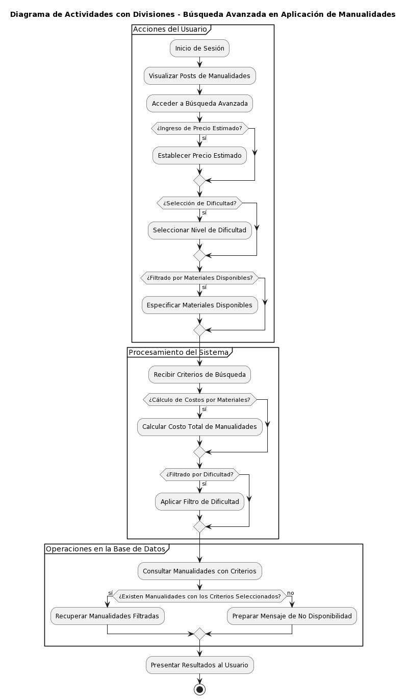

<h1>BlazorServerApp</h1>
<h2>Framework</h2>

<h3>Blazor Server-Side</h3>

Blazor permite crear aplicaciones web utilizando .NET. Existen dos enfoques principales: Server-Side y Client-Side. En esta aplicación, hemos elegido trabajar con Blazor Server-Side. 

Una de las principales ventajas de Blazor Server-Side es que permite manejar una base de datos directamente desde el backend del código, permitiendo operaciones más integradas y fluidas. Por otro lado, Blazor Client-Side, también conocido como WebAssembly, se ejecuta de manera más rápida, pero no posee la misma facilidad para manejar bases de datos directamente. En lugar de eso, realiza llamadas a APIs para obtener o manipular datos.

Blazor como framework es revolucionario ya que permite que el navegador interprete C# directamente. Es un framework orientado a componentes, lo que implica que se debe apuntar a que los componentes sean reutilizables y modulares.

<h2>Descripción de la aplicación</h2>

La aplicación es una red social destinada a eventos, celebraciones y días internacionales en países hispanohablantes. Los usuarios tendrán acceso a un calendario general y podrán visualizar y compartir DIY (Hazlo Tú Mismo) para festividades, utilizando materiales comunes y accesibles.

<h3>Características principales:</h3>

<ol>
    <li><strong>Calendario General</strong>: Donde se muestran los días festivos y celebraciones de los países hispanohablantes.</li>
    <li><strong>Publicaciones DIY</strong>: Los usuarios pueden subir y compartir sus propias creaciones con instrucciones, links a videos, insumos utilizados, costos, tiempo de realización, entre otros detalles.</li>
    <li><strong>Filtro Personalizado</strong>: Los usuarios pueden filtrar las publicaciones según sus necesidades y preferencias.</li>
    <li><strong>Búsqueda por Material</strong>: Si un usuario tiene ciertos materiales a mano, puede buscar proyectos que los utilicen.</li>
    <li><strong>Calendario Personal</strong>: Dependiendo del avance del proyecto, cada usuario podrá tener un calendario propio para fechas personales importantes.</li>
</ol>

<h2>Tecnologías y herramientas</h2>

<h3>Firebase</h3>

La aplicación se integra con Firebase para manejar autenticación de usuarios y como base de datos para las publicaciones. Firebase proporciona soluciones escalables y en tiempo real para nuestras necesidades.

<h3>Modelo-Vista-Controlador (MVC)</h3>

Para mantener el código organizado y facilitar su mantenimiento, se ha decidido utilizar el patrón arquitectónico Modelo-Vista-Controlador (MVC). Esto nos permite separar la lógica de negocio, la interfaz de usuario y el acceso a los datos.

<h2>Acquitectura del frameWork</h2>
<h3>Introducción a Blazor y WebAssembly</h3>

El marco de desarrollo web <strong>Blazor</strong>, desarrollado por Microsoft, ha generado un notable interés en la comunidad de desarrollo debido a su capacidad para permitir la construcción de aplicaciones web utilizando C# en lugar de JavaScript. La base de esta innovación se encuentra en la tecnología conocida como WebAssembly (WASM).

<h4>1. WebAssembly (WASM)</h4>

<strong>WebAssembly</strong> es un formato de código binario diseñado para ser un objetivo de compilación eficiente para lenguajes de alto nivel como C/C++ y Rust. Esta tecnología permite que el código se ejecute en navegadores a velocidades cercanas al rendimiento nativo.

<h4>2. MonoWASM</h4>

El proyecto <strong>Mono</strong> representa una implementación de código abierto del marco .NET. <strong>MonoWASM</strong> es una versión adaptada de Mono diseñada para ejecutarse sobre WebAssembly. Esencialmente, actúa como un intérprete de .NET dentro del contexto del navegador, facilitando la ejecución del código C#.

<h4>3. Blazor</h4>

<strong>Blazor</strong> aprovecha las capacidades de MonoWASM y WASM para ejecutar aplicaciones web escritas en C#. Las aplicaciones se construyen utilizando un modelo de componentes, similar a frameworks modernos como React o Angular. Blazor se presenta en dos variantes principales:

<ul>
    <li><strong>Blazor WebAssembly</strong>: La aplicación y sus dependencias se descargan y ejecutan en el navegador utilizando WebAssembly.</li>
    <li><strong>Blazor Server</strong>: El código C# se ejecuta en el servidor y solo los eventos y actualizaciones de la interfaz de usuario se transmiten al navegador mediante una conexión en tiempo real.</li>
</ul>

<h1>Descripción de la Arquitectura de Mi Proyecto</h1>

Estoy desarrollando una solución en .NET. Mi proyecto principal se construye con Blazor Server Side y se encarga de la capa de <strong>Presentación</strong>. Aquí gestiono la interacción del usuario con la interfaz, mostrando la información y capturando sus acciones. Aunque Blazor no sigue estrictamente el patrón MVC, he estructurado este proyecto de manera similar con componentes que actúan como vistas, lógica de componentes que funcionan como controladores y modelos de datos.

<h2>Lógica de Negocio</h2>

El núcleo de mi aplicación reside en el proyecto de <strong>Servicios</strong>, donde he encapsulado la lógica central como encriptación, helpers y requests a la API. Esta capa se encarga de las operaciones cruciales y de la lógica del negocio.

Adicionalmente, para garantizar la seguridad de los usuarios, me conecto a una API de Google para autenticarlos. Esto garantiza que cada usuario es quien dice ser y me proporciona una capa adicional de seguridad.

<h2>Acceso a Datos</h2>

La persistencia de datos es manejada por Firebase. Gracias a un paquete NuGet en C#, puedo interactuar fácilmente con esta base de datos, realizando operaciones CRUD y gestionando la información de los usuarios y otros datos relevantes.

<h1>Login</h1>

En este caso el login lo hemos realizaod con identity al importando el paquete NuGET de Identity y despues añadiendolo a las dependencias del program.cs. Despues de tener esa dependencia lo que debemos de hacer es crear un AuthenticationProvider perosnalizado para que podamos estbalecer nosotros mismos los claims o datos que queremos que se guarden del usuario. Esto es util ya que podriamos por ejemplo asignar roles. Finalmente mediante los componentes de authorizationviews en las vistas injectamos la dependencia del AuthenticationStatePorvider personalizado y mediante AuthorizationViews podemos escoger que es lo que ve el usuario autenticado o que ha iniciado sesion y lo que no puede ser el usuario que no ha iniciado sesiòn

<h1>Diagrama del login</h1>

En este caso el login lo hemos realizaod con identity al importando el paquete NuGET de Identity y despues añadiendolo a las dependencias del program.cs. Despues de tener esa dependencia lo que debemos de hacer es crear un AuthenticationProvider perosnalizado para que podamos estbalecer nosotros mismos los claims o datos que queremos que se guarden del usuario. Esto es util ya que podriamos por ejemplo asignar roles. Finalmente mediante los componentes de authorizationviews en las vistas injectamos la dependencia del AuthenticationStatePorvider personalizado y mediante AuthorizationViews podemos escoger que es lo que ve el usuario autenticado o que ha iniciado sesion y lo que no puede ser el usuario que no ha iniciado sesiòn

<h2>Explicaciôn del diagrama del login (Diagrama de actividades)</h2>

<h2>Explicaciôn del diagrama del login (Diagrama de actividades)</h2>

EN cuanto a la explicación detallada del diagrama de actividad:

Inicio del Programa: El proceso comienza cuando un usuario intenta iniciar sesión en el sistema.

Validación de Credenciales: Se realiza una verificación para determinar si el usuario proporcionó credenciales válidas. Esto podría incluir un nombre de usuario y una contraseña.

Llamada al Método LoginUser en UserController: Si las credenciales son válidas, se llama al método LoginUser en la clase UserController. Este método se encarga de la lógica de autenticación.

Verificación de Credenciales en la Base de Datos: El método LoginUser en UserController realiza la verificación de las credenciales en la base de datos.

Credenciales Correctas: Si las credenciales son correctas, se procede a actualizar el estado de autenticación llamando al método UpdateAuthenticationState en la clase CustomAuthenticationStateProvider.

Almacenamiento de Información del Usuario en la Sesión: Se almacena la información del usuario en la sesión. En este caso, el método SetAsync en _sessionStorage se utiliza para almacenar información del usuario.

Permitir el Acceso al Sistema: Con las credenciales verificadas y la sesión actualizada, se permite el acceso al sistema.

Credenciales Incorrectas: Si las credenciales no son correctas, se muestra un mensaje de error al usuario. Este flujo puede incluir otras actividades, como bloquear la cuenta después de varios intentos fallidos, dependiendo de los requisitos de seguridad.

Fin del Programa: El proceso concluye, ya sea con el acceso al sistema o con un mensaje de error.

<h2>Ejercicio MVC Resueltoi por el MiniCore</h2>

    Bueno, para este punto, ya se puede hablar de la arquitectura del sistema desde una perspectiva más amplia. Lo que se puede apreciar en el diagrama de arquitectura es la función que cumple cada componente del sistema, partiendo desde el usuario. En este caso, el usuario ya puede acceder a la web ya que esta cuenta con su propio dominio. A su vez, el dominio y todo lo que ve el usuario está hospedado en Azure. Es importante también mencionar qué tipo de servicios se está usando. Azure, en este caso (nuestro host), se trata de una PaaS (Plataforma como Servicio) ya que lo único de lo que debemos preocuparnos es de que nuestra aplicación se vea bien y funcione correctamente. Este tipo de servicios se encarga de gestionar todo el ambiente de red, seguridad, conectividad y compatibilidad de los componentes de nuestro proyecto. Es por ello que esta es una de las mejores opciones para este tipo de proyecto, ya que en la etapa en la que se encuentra no posee usuarios suficientes como para requerir escalamiento. Además, otro servicio al que está conectado es al de la nube de Google, que en este caso nos provee de una base de datos documental. Debido a que este framework soporta operaciones pesadas dentro de su Core, podemos sacar mucho provecho a la conexión directa con esta base de datos.

    <h2>Diagrama de Componentes del Sistema MVC con Firestore</h2>

La aplicación se desarrolla bajo el patrón Modelo-Vista-Controlador (MVC), y el siguiente es un desglose detallado de cómo funcionan juntos los componentes principales:

<ul>
    <li>
        <strong>Usuario:</strong>
        
Representa al individuo que interactúa con la aplicación web. El usuario accede a la interfaz proporcionada por la vista y realiza diversas acciones, como consultar ventas.

    </li>
    <li>
        <strong>Vista - /ventas:</strong>
        
Es la interfaz gráfica que se muestra al usuario. En este caso, la vista "/ventas" muestra una lista de ventas y permite filtrarlas por fecha. La vista es responsable de recopilar la interacción del usuario y solicitar datos al controlador.

    </li>
    <li>
        <strong>Controlador - VentaController:</strong>
        
El controlador gestiona las solicitudes provenientes de la vista. Interpreta las acciones del usuario, interactúa con los modelos y la base de datos, y proporciona los datos necesarios de vuelta a la vista. En este sistema, el controlador "VentaController" tiene métodos para crear ventas y obtener todas las ventas, entre otros.

    </li>
    <li>
        <strong>Modelo - User:</strong>
        
El modelo "User" representa la estructura de datos de un usuario o vendedor. Contiene propiedades como edad, nombre, contraseña, entre otros. Este modelo es esencial para comprender y estructurar la información del usuario en la base de datos y dentro de la aplicación.

    </li>
    <li>
        <strong>Modelo - Venta:</strong>
        
El modelo "Venta" representa la estructura de datos de una venta. Tiene propiedades como fecha, ID del usuario (vendedor), producto y monto de cuota. Asimismo, se relaciona con el modelo "User" a través de la propiedad "Vendedor".

    </li>
    <li>
        <strong>Firestore - Base de Datos:</strong>
        
Representa la solución de base de datos utilizada, que en este caso es Firestore de Google Cloud. Aquí se almacenan y consultan todos los datos de la aplicación. El controlador interactúa directamente con Firestore para guardar y recuperar información, utilizando el SDK proporcionado por Google.

    </li>
</ul>

Esta estructura permite una separación de responsabilidades, facilitando el mantenimiento, escalabilidad y modificación del sistema en el futuro.

<h1>Roles y Administrción</h1>

    En el útlimo commit lo que se ha implementado ha sido la adminsitración y los roles ya que en este caso la admisnitración se la trata como un rol. En funcionamiento es bastante sencillo ya que se ha incluido un campo en la base de datos que hace referencia a este rol del usuario y con ayuda de los componentes de autorización de blazor se ha logrado personalizar vistas y validar acciones por parte del adminsitrador.

    Además este no ha sido el único rol que se ha implmeentado, ya que tememos otros roles como el de técnico, team para los cuales todavia no hay funciones asignadas; y el más común que es el de usuario para cualquer persona que se registre en la plataforma

<h2>Acciones del Administrador</h2>
<ul>
    <li><strong>Inicio de Sesión del Administrador</strong>
        <ul>
            <li>Accede a un menú personalizado.</li>
        </ul>
    </li>
    <li><strong>Gestión de Usuarios</strong>
        <ul>
            <li>Visualiza una lista de todos los usuarios.</li>
            <li>Opciones para cada usuario:
                <ul>
                    <li>Eliminar usuario.</li>
                    <li>Editar usuario.</li>
                    <li>Registrar un nuevo usuario.</li>
                </ul>
            </li>
        </ul>
    </li>
    <li><strong>Asignación de Roles</strong>
        <ul>
            <li>Al crear un usuario, el administrador asigna roles (técnico, team, creador de contenido).</li>
        </ul>
    </li>
    <li><strong>Visualización de Usuarios por Rol</strong>
        <ul>
            <li>Ve cuántos usuarios hay en cada rol.</li>
        </ul>
    </li>
    <li><strong>Gestión de Contenidos</strong>
        <ul>
            <li>Opción para eliminar publicaciones de cualquier usuario desde la pantalla de inicio.</li>
        </ul>
    </li>
</ul>
<h2>Diagrama de interacción</h2>

<h1>Funcionalidad de Búsqueda Avanzada en la Aplicación de Manualidades</h1>

    La última actualización de nuestra aplicación incluye una característica de búsqueda avanzada, diseñada para mejorar la experiencia del usuario en nuestra red social de manualidades. Esta funcionalidad permite a los usuarios buscar manualidades basándose en criterios específicos como el precio estimado de la manualidad, el nivel de dificultad, y los materiales disponibles.

    Esta funcionalidad es especialmente útil para los usuarios que buscan inspiración para proyectos dentro de un presupuesto específico, o que quieren encontrar proyectos que coincidan con su nivel de habilidad o los materiales que ya tienen.

<h2>Características de la Búsqueda Avanzada</h2>
<ul>
    <li><strong>Ingreso de Precio Estimado</strong>
        <ul>
            <li>Los usuarios pueden especificar un precio estimado para encontrar manualidades que se ajusten a su presupuesto.</li>
        </ul>
    </li>
    <li><strong>Selección de Dificultad</strong>
        <ul>
            <li>Los proyectos se pueden filtrar por nivel de dificultad, desde principiante (1) hasta experto (5).</li>
        </ul>
    </li>
    <li><strong>Filtrado por Materiales</strong>
        <ul>
            <li>Permite a los usuarios buscar proyectos basándose en los materiales que tienen a mano.</li>
        </ul>
    </li>
</ul>
<h2>Proceso de Búsqueda y Resultados</h2>
<ul>
    <li><strong>Procesamiento de Búsqueda</strong>
        <ul>
            <li>Calcula el costo total basado en los materiales y cantidades necesarias para cada proyecto.</li>
            <li>Filtra los proyectos según la dificultad y los materiales especificados.</li>
        </ul>
    </li>
    <li><strong>Presentación de Resultados</strong>
        <ul>
            <li>Muestra una lista de manualidades recomendadas y clasificadas por dificultad.</li>
            <li>Incluye verificaciones para asegurar que hay proyectos disponibles en cada nivel de dificultad.</li>
        </ul>
    </li>
</ul>
<h2>Diagrama de Actividades de la Búsqueda Avanzada</h2>

